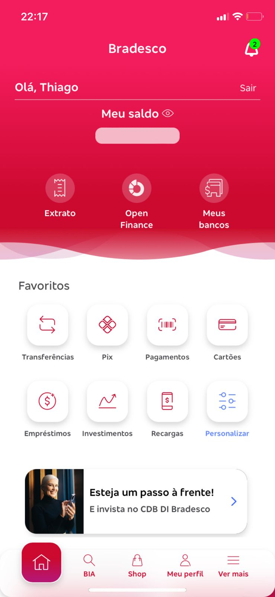
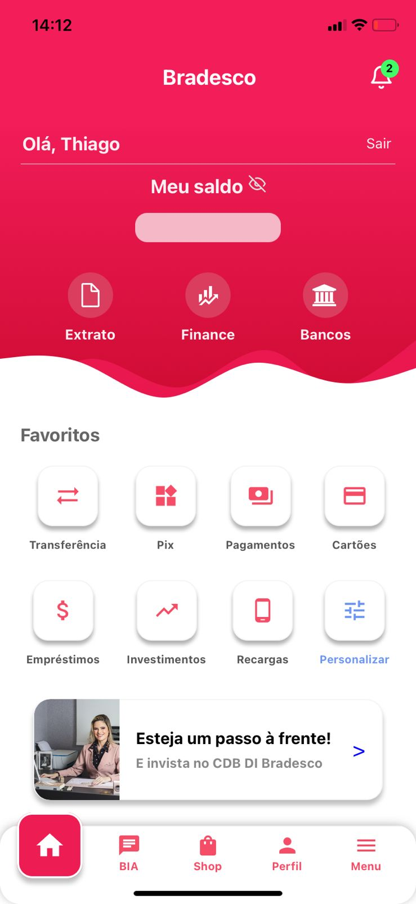

# Clone de Tela - Bradesco App

Este projeto é um trabalho individual que consiste em replicar o layout de uma tela de um aplicativo de sua escolha. O objetivo foi recriar o design, sem a necessidade de implementar funcionalidades.

## Tela Escolhida

A tela escolhida para o desafio foi a tela principal do **Aplicativo do Bradesco**. 

### Print da Tela Original

---

## Tela Desenvolvida

Abaixo está a réplica da tela criada com base no design original.

### Print da Tela Clonada

---

